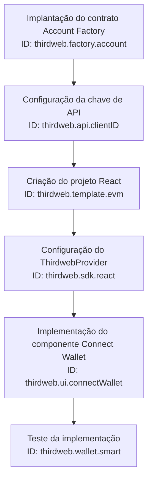
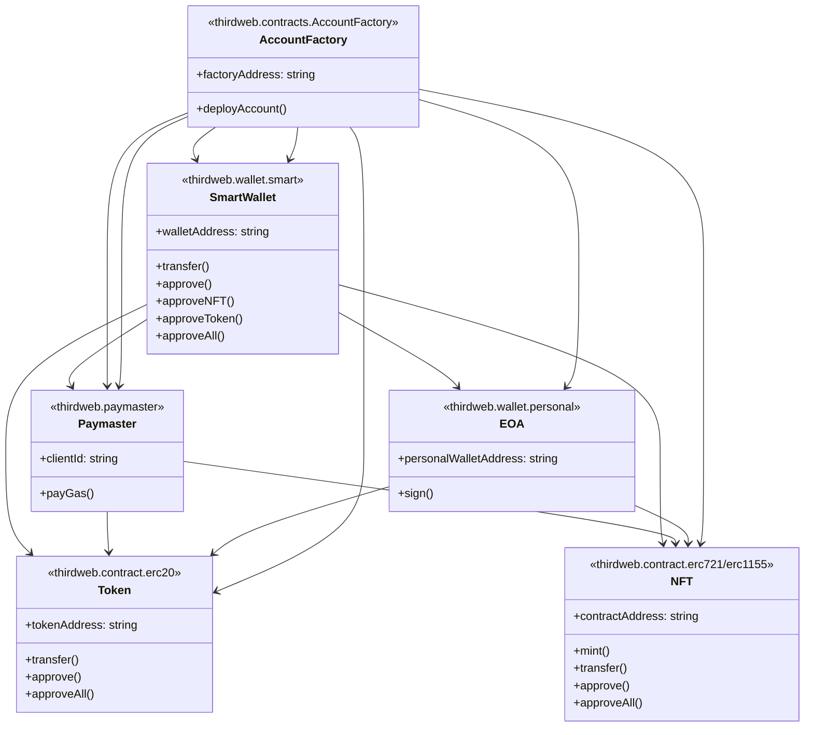

# Tutorial Passo a Passo: Carteiras Inteligentes ERC-4337 com Thirdweb

## Sumário
- [Introdução](#introdução)
- [Parte 1: Implementação com o Componente UI "Connect Wallet"](#parte-1-implementação-simples-com-o-componente-de-ui-connect-wallet)
- [Parte 2: Implementação Personalizada com SDK](#parte-2-implementação-com-fluxo-personalizado-e-sdk)
- [Conclusão](#conclusão)

## Introdução

Neste tutorial, você aprenderá a implementar carteiras inteligentes ERC-4337 utilizando a plataforma Thirdweb. Vamos explorar duas abordagens:

1. **Implementação simples** usando o componente UI "Connect Wallet" (para rápida implementação)
2. **Implementação personalizada** usando o SDK da Thirdweb (para maior controle)

> **NOTA IMPORTANTE**: Este tutorial foi desenvolvido com a rede de teste **Sepolia**.

### O que são Carteiras Inteligentes ERC-4337?

Carteiras inteligentes ERC-4337 são carteiras de criptomoedas controladas por **contratos inteligentes** em vez de chaves privadas tradicionais. Isso traz diversas vantagens:

- Elimina a necessidade de gerenciar chaves privadas complexas
- Melhora significativamente a experiência do usuário
- Permite recursos avançados que carteiras tradicionais não suportam

### Por que usar Carteiras Inteligentes?

As carteiras inteligentes da Thirdweb oferecem recursos poderosos:

* ✅ **Múltiplos proprietários** por carteira (multisig)
* ✅ Execução de **transações únicas e em lote** 
* ✅ Envio e recebimento de **tokens nativos e NFTs** (ERC-721 e ERC-1155)
* ✅ **Transações sem gás (gasless)** através de um "paymaster"
* ✅ Abstração da interação com a blockchain, permitindo **transações sem assinatura**

Estes recursos resolvem muitos dos problemas que dificultam a adoção em massa da Web3, como a complexidade do gerenciamento de chaves e os custos de transação.

## Parte 1: Implementação Simples com o Componente de UI "Connect Wallet"

Nesta primeira parte, implementaremos carteiras inteligentes de forma rápida e direta usando o componente "Connect Wallet" da Thirdweb.

### Visão Geral desta Seção:



1. Implantação do contrato Account Factory (no dashboard Thirdweb)
2. Configuração da chave de API (no dashboard Thirdweb)
3. Criação do projeto React (via CLI)
4. Configuração do ThirdwebProvider com smart wallets
5. Implementação do componente Connect Wallet
6. Teste da implementação

### Class Diagram



O diagrama acima mostra as relações entre os contratos e as classes da Thirdweb, incluindo os identificadores específicos de cada componente.

### Passo 1: Implantação do Contrato de Fábrica de Contas (Account Factory)

Antes de começarmos a codificar, precisamos implantar o contrato que criará nossas carteiras inteligentes.

1. Acesse o **[dashboard da Thirdweb](https://thirdweb.com/dashboard)**.
2. **Conecte sua carteira** ao dashboard.
3. Navegue até a seção de **"Contracts"** e clique em **"Deploy new contract"**.
4. Na seção de populares (ou procurando por "smart wallets"), localize e selecione o contrato **"Account Factory"** (ID: `thirdweb.contracts.AccountFactory`).
   > **Por quê?** Este contrato é essencial pois funciona como uma "fábrica" que cria carteiras inteligentes para seus usuários.
5. Selecione a rede onde você deseja implantar o contrato. Para este tutorial, use a rede **Sepolia**. Clique em **"Deploy Now"**.
6. Confirme as transações necessárias em sua carteira.
7. **Copie o endereço do contrato Account Factory** após a implantação. Este é um endereço crucial que usaremos em várias partes do código.

### Passo 2: Configuração da Chave de API Thirdweb

Para utilizar os recursos da Thirdweb, incluindo transações sem gás, precisamos configurar uma chave de API.

1. No dashboard da Thirdweb, vá para a seção de **"Settings"** e clique em **"API Keys"**.
2. Clique em **"Create API Key"**. Dê um nome significativo, como "smart-wallet-demo".
3. Na seção de permissões, você tem duas opções:
   - **Acesso irrestrito**: Mais simples, mas menos seguro
   - **Acesso específico a contratos**: Recomendado para produção e transações sem gás
   
   > **Dica de segurança**: Para aplicações em produção, sempre limite o acesso da sua API apenas aos contratos necessários.

4. Se escolher acesso específico, adicione os endereços dos contratos com os quais sua aplicação vai interagir:
   - Contratos de NFT (ERC-1155)
   - Contratos de token (ERC-20)
   - Outros contratos relevantes
   
5. Na seção de domínios, restrinja o uso da API a domínios específicos:
   - Para desenvolvimento local: `http://localhost:3000`
   - Para produção: seu domínio real

6. Clique em **"Create"** e salve com segurança:
   - **Client ID** (ID: `thirdweb.api.clientID`): Você vai usar em seu código
   - **Secret Key**: Guarde em um local seguro (mostrada apenas uma vez)

> **Nota sobre produção**: Para usar smart wallets na rede principal (Mainnet) e habilitar transações sem gás, você precisará adicionar um método de pagamento na seção "Account and Billing".

### Passo 3: Criação de um Novo Projeto React

Agora que temos nossa infraestrutura blockchain pronta, vamos criar o projeto frontend.

1. Abra seu **terminal** e execute:

   ```bash
   npx thirdweb create app --evm --framework next --typescript smart-wallet-simple
   ```

   > **O que isto faz?** Este comando cria um novo projeto Next.js com TypeScript e configurações iniciais para trabalhar com a Thirdweb (ID: `thirdweb.template.evm`).

2. Navegue até o diretório do projeto:

   ```bash
   cd smart-wallet-simple
   ```

3. Abra o projeto em seu editor de código favorito.

### Passo 4: Configuração do Aplicativo para Smart Wallets

Este é um passo crítico onde configuramos nosso aplicativo para usar carteiras inteligentes.

1. Abra o arquivo **`_app.tsx`** na pasta `pages`.

2. Modifique a configuração do `ThirdwebProvider` (ID: `thirdweb.sdk.react`) para incluir:
   - Rede correta (Sepolia em vez de Mumbai)
   - Client ID da sua chave de API
   - Configuração das smart wallets
   - Opções de carteira pessoal (EOA)

   Primeiro, crie um arquivo `.env.local` na raiz do projeto:

   ```
   NEXT_PUBLIC_THIRDWEB_CLIENT_ID=SEU_CLIENT_ID
   ```

   Em seguida, edite o `_app.tsx`:

   ```typescript jsx
   import { ThirdwebProvider, smartWallet, paperWallet } from '@thirdweb-dev/react';
   import type { AppProps } from 'next/app';
   import { Sepolia } from '@thirdweb-dev/chains';

   function MyApp({ Component, pageProps }: AppProps) {
     return (
       <ThirdwebProvider
         activeChain={Sepolia}
         clientId={process.env.NEXT_PUBLIC_THIRDWEB_CLIENT_ID}
         supportedWallets={[
           smartWallet({ 
             factoryAddress: 'SEU_ENDEREÇO_DA_FACTORY', 
             gasless: true 
           }),
         ]}
         personalWallets={[
           paperWallet({ clientId: 'SEU_PAPER_CLIENT_ID' }),
         ]}
       >
         <Component {...pageProps} />
       </ThirdwebProvider>
     );
   }

   export default MyApp;
   ```

   > **Conexão com passos anteriores**: O `factoryAddress` é o endereço do contrato Account Factory que implantamos no Passo 1. O `clientId` vem da chave de API configurada no Passo 2.

3. **Substituições importantes**:
   - Substitua `'SEU_ENDEREÇO_DA_FACTORY'` pelo endereço copiado no Passo 1
   - Substitua `'SEU_PAPER_CLIENT_ID'` pelo ID do Paper (se estiver usando carteira baseada em email)
   - Use `Sepolia` em vez de `Mumbai` como rede

   > **O que está acontecendo aqui?** Estamos configurando o ThirdwebProvider para:
   > - Usar a rede Sepolia
   > - Ativar smart wallets com transações sem gás
   > - Permitir login via email (carteira Paper)

### Passo 5: Implementação do Componente "Connect Wallet"

A beleza desta abordagem está na simplicidade - precisamos apenas adicionar o componente ConnectWallet ao nosso aplicativo.

1. Abra o arquivo **`index.tsx`** na pasta `pages`.

2. Substitua o conteúdo existente pelo seguinte código:

   ```typescript jsx
   import { ConnectWallet } from "@thirdweb-dev/react";
   import styles from "../styles/Home.module.css";

   export default function Home() {
     return (
       <div className={styles.container}>
         <main className={styles.main}>
           <h1>Meu Aplicativo Web3 com Smart Wallets</h1>
           <ConnectWallet />
         </main>
       </div>
     );
   }
   ```

   > **O que faz esse componente?** O `ConnectWallet` (ID: `thirdweb.ui.connectWallet`) é um componente completo de UI que gerencia todo o fluxo de conexão de carteira, incluindo a criação e gerenciamento de smart wallets.

### Passo 6: Teste da Implementação Simples

Vamos testar nossa implementação para ver as carteiras inteligentes em ação.

1. Execute o aplicativo:

   ```bash
   yarn dev
   ```

2. Acesse `http://localhost:3000` no navegador.

3. Clique no botão **"Connect Wallet"** e observe:
   - Um modal aparecerá com opção de conectar por email
   - Esta interface já está integrada com smart wallets!

4. Teste o fluxo completo:
   - Insira seu email e clique em "Continue"
   - Verifique seu email e insira o código OTP recebido
   - Uma carteira Paper será criada como EOA (ID: `thirdweb.wallet.personal`)
   - Uma smart wallet será criada usando esta carteira Paper como proprietária (ID: `thirdweb.wallet.smart`)
   - O endereço da smart wallet será o conectado ao aplicativo

5. Para testar transações sem gás:
   - Adicione um botão em `index.tsx` que interage com um contrato permitido
   - Ao clicar, a transação ocorrerá sem custo para o usuário através do paymaster (ID: `thirdweb.paymaster`)
   - Verifique o resultado em um explorador blockchain

> **Conexão conceitual**: Observe como o smart wallet usa a carteira Paper (EOA) como proprietário, mas o usuário interage diretamente com o smart wallet. Isso cria uma abstração que simplifica a experiência.

## Parte 2: Implementação com Fluxo Personalizado e SDK

Na segunda parte, criaremos uma experiência mais personalizada e imersiva usando diretamente o SDK da Thirdweb.

### Visão Geral desta Seção:
Esta implementação nos dará controle total sobre:
- O fluxo de login e criação de contas
- A interação com contratos
- A experiência visual do usuário
- Funcionalidades personalizadas como "pacotes iniciais" de NFTs

### Passo 7: Criação de um Novo Projeto React

Vamos criar um novo projeto para esta implementação avançada.

1. No terminal, execute:

   ```bash
   npx thirdweb create app --evm --framework next --typescript smart-wallet-custom
   ```

2. Navegue até o diretório:

   ```bash
   cd smart-wallet-custom
   ```

3. Abra o projeto no seu editor de código.

### Passo 8: Configuração Básica do ThirdwebProvider

Primeiro, configuramos o ThirdwebProvider básico. Posteriormente, usaremos uma abordagem diferente para as smart wallets.

1. Abra **`_app.tsx`** na pasta `pages` e atualize:

   ```typescript jsx
   import { ThirdwebProvider } from '@thirdweb-dev/react';
   import type { AppProps } from 'next/app';
   import { Sepolia } from '@thirdweb-dev/chains';

   function MyApp({ Component, pageProps }: AppProps) {
     return (
       <ThirdwebProvider 
         activeChain={Sepolia} 
         clientId={process.env.NEXT_PUBLIC_THIRDWEB_CLIENT_ID}
       >
         <Component {...pageProps} />
       </ThirdwebProvider>
     );
   }

   export default MyApp;
   ```

   > **Por que é diferente da Parte 1?** Aqui não configuramos as smart wallets no ThirdwebProvider principal porque vamos criar uma implementação personalizada usando o SDK (ID: `thirdweb.sdk.typescript`).

### Passo 9: Criação do Arquivo de Configuração de Endereços

Para manter o código organizado, centralizaremos os endereços dos contratos em um arquivo.

1. Crie uma pasta **`const`** na raiz do projeto.
2. Crie um arquivo **`addresses.ts`** dentro desta pasta:

   ```typescript
   // Substitua com seus endereços reais implantados na rede Sepolia
   export const ACCOUNT_FACTORY_ADDRESS = 'SEU_ENDEREÇO_DA_FACTORY'; // ID: thirdweb.contracts.AccountFactory
   export const MONSTER_CONTRACT_ADDRESS = 'SEU_ENDEREÇO_DO_CONTRATO_NFT'; // ID: thirdweb.contracts.erc1155
   export const TOKEN_CONTRACT_ADDRESS = 'SEU_ENDEREÇO_DO_CONTRATO_TOKEN'; // ID: thirdweb.contracts.erc20
   ```

   > **Conexão com passos anteriores**: O `ACCOUNT_FACTORY_ADDRESS` é o mesmo endereço do contrato que implantamos no Passo 1 da Parte 1. Os outros endereços são de contratos que você deve implantar na mesma rede (Sepolia).

### Passo 10: Criação do Componente de Login

Agora, vamos criar um componente de login personalizado que usará uma senha para criar uma carteira local.

1. Crie uma pasta **`components`** na raiz do projeto.

2. Crie um arquivo **`login.tsx`** dentro desta pasta:

   ```typescript jsx
   import { useState } from 'react';
   import { connectSmartWallet } from '../lib/wallet';
   import { Connected } from './connected';

   export const Login = () => {
     const [password, setPassword] = useState('');
     const [loadingStatus, setLoadingStatus] = useState('');
     const [isLoading, setIsLoading] = useState(false);
     const [signer, setSigner] = useState<any>(null);

     const connectWallet = async () => {
       try {
         setIsLoading(true);
         const result = await connectSmartWallet(
           password,
           setLoadingStatus,
           process.env.NEXT_PUBLIC_THIRDWEB_CLIENT_ID || ''
         );
         setSigner(result);
       } catch (error) {
         console.error("Erro ao conectar carteira:", error);
         setLoadingStatus("Erro ao conectar. Tente novamente.");
       } finally {
         setIsLoading(false);
       }
     };

     // Renderiza componente Connected se o signer existir,
     // caso contrário, mostra o formulário de login
     if (signer) {
       return <Connected signer={signer} />;
     }

     return (
       <div className="login-container">
         <h1>TWW Monsters</h1>
         <h2>Acesse sua conta de treinador</h2>
         
         <div className="form-group">
           <label>Senha</label>
           <input 
             type="password" 
             value={password}
             onChange={(e) => setPassword(e.target.value)}
             placeholder="Crie ou use uma senha existente"
           />
         </div>
         
         <button 
           onClick={connectWallet}
           disabled={isLoading || !password}
         >
           {isLoading ? 'Conectando...' : 'Login'}
         </button>
         
         {isLoading && (
           <div className="loading-status">
             <p>{loadingStatus}</p>
           </div>
         )}
       </div>
     );
   };
   ```

   > **O que este componente faz?** Ele cria uma interface para o usuário inserir uma senha, que será usada para criar ou acessar uma carteira local (LocalWallet, ID: `thirdweb.wallet.local`). Esta carteira local funcionará como a EOA (proprietária) por trás da smart wallet.

### Passo 11: Criação das Funções de Carteira

Esta é a parte mais técnica do tutorial. Aqui, implementaremos a lógica para criar e conectar smart wallets.

1. Crie uma pasta **`lib`** na raiz do projeto.

2. Crie um arquivo **`wallet.ts`** dentro desta pasta:

   ```typescript
   import { ThirdwebSDK } from '@thirdweb-dev/sdk'; // ID: thirdweb.sdk.typescript
   import { Sepolia } from '@thirdweb-dev/chains';
   import { SmartWallet, LocalWallet } from '@thirdweb-dev/wallets';
   import { ACCOUNT_FACTORY_ADDRESS, MONSTER_CONTRACT_ADDRESS, TOKEN_CONTRACT_ADDRESS } from '../const/addresses';

   // Função para criar uma instância de smart wallet
   export const createSmartWallet = (clientId: string) => {
     return new SmartWallet({
       chain: Sepolia,
       factoryAddress: ACCOUNT_FACTORY_ADDRESS, // ID: thirdweb.contracts.AccountFactory
       gasless: true,
       clientId, // ID: thirdweb.api.clientID
     });
   };

   // Função principal para conectar o smart wallet
   export const connectSmartWallet = async (
     password: string,
     setLoadingStatus: (status: string) => void,
     clientId: string
   ) => {
     setLoadingStatus('Procurando conta de treinador...');

     // 1. Criar instâncias de smart wallet e carteira local
     const smartWallet = createSmartWallet(clientId); // ID: thirdweb.wallet.smart
     const personalWallet = new LocalWallet(); // ID: thirdweb.wallet.local

     // 2. Carregar ou criar carteira local usando a senha
     await personalWallet.loadOrCreate({
       strategy: 'encryptedJson',
       password,
     });

     // 3. Conectar smart wallet usando a carteira local como proprietária
     await smartWallet.connect({ personalWallet });

     // 4. Criar SDK para interagir com contratos
     const sdk = new ThirdwebSDK(smartWallet, { clientId });
     const walletAddress = await smartWallet.getAddress();
     
     // 5. Verificar se o smart wallet já está implantado
     const provider = sdk.getProvider();
     const code = await provider.getCode(walletAddress);
     const isDeployed = code !== '0x';

     // 6. Se for um novo smart wallet, enviar NFT e tokens iniciais
     if (!isDeployed) {
       setLoadingStatus('Nova conta detectada. Criando conta...');
       
       // Obter referências aos contratos
       const monsterContract = await sdk.getContract(MONSTER_CONTRACT_ADDRESS); // ID: thirdweb.contracts.erc1155
       const tokenContract = await sdk.getContract(TOKEN_CONTRACT_ADDRESS); // ID: thirdweb.contracts.erc20

       // Preparar transações
       const claimNftTransaction = await monsterContract.erc1155.claim(0, 1);
       const claimTokensTransaction = await tokenContract.erc20.claim(10);

       // Executar transações em lote
       setLoadingStatus('Enviando monstro inicial e fundos iniciais...');
       const batchTransaction = await smartWallet.executeBatch([
         claimNftTransaction,
         claimTokensTransaction,
       ]);
       
       // Aguardar confirmação
       await batchTransaction.wait();
       setLoadingStatus('Pacote inicial enviado!');
     } else {
       setLoadingStatus('Conta de treinador encontrada. Carregando monstros...');
     }

     // 7. Retornar o signer para uso na aplicação
     return await smartWallet.getSigner();
   };
   ```

   > **Análise do código**: Este código faz várias coisas importantes:
   > 1. Cria uma carteira local protegida por senha (ID: `thirdweb.wallet.local`)
   > 2. Cria um smart wallet que usa a carteira local como proprietária (ID: `thirdweb.wallet.smart`)
   > 3. Verifica se o smart wallet já foi implantado antes
   > 4. Para novos usuários, envia automaticamente ativos iniciais (NFT e tokens)
   > 5. Utiliza transações em lote para realizar múltiplas operações em uma única transação
   > 6. Implementa transações sem gás para melhor UX (ID: `thirdweb.paymaster`)

### Passo 12: Criação do Componente Connected

Este componente gerenciará a experiência do usuário após o login.

1. Crie um arquivo **`connected.tsx`** na pasta `components`:

   ```typescript jsx
   import { ThirdwebProvider } from '@thirdweb-dev/react'; // ID: thirdweb.sdk.react
   import { Sepolia } from '@thirdweb-dev/chains';
   import { UserProfile } from './profile';
   import { NavBar } from './NavBar';

   interface ConnectedProps {
     signer: any;
   }

   export const Connected: React.FC<ConnectedProps> = ({ signer }) => {
     return (
       <ThirdwebProvider 
         signer={signer} 
         activeChain={Sepolia} 
         clientId={process.env.NEXT_PUBLIC_THIRDWEB_CLIENT_ID}
       >
         <div className="app-container">
           <NavBar />
           <UserProfile />
         </div>
       </ThirdwebProvider>
     );
   };
   ```

   > **Por que um segundo ThirdwebProvider?** Aqui configuramos um segundo ThirdwebProvider que usa o signer do smart wallet conectado. Isso permite que os componentes dentro dele interajam com a blockchain como o smart wallet.

### Passo 13: Criação do Componente NavBar

Um simples componente de navegação para nossa aplicação.

1. Crie um arquivo **`NavBar.tsx`** na pasta `components`:

   ```typescript jsx
   export const NavBar = () => {
     return (
       <header className="navbar">
         <div className="logo">TWW Monsters</div>
       </header>
     );
   };
   ```

### Passo 14: Criação do Componente UserProfile

Este componente exibirá os ativos do usuário e permitirá interações com os contratos.

1. Crie um arquivo **`profile.tsx`** na pasta `components`:

   ```typescript jsx
   import { useState } from 'react';
   import { 
     useAddress, 
     useContract, 
     useOwnedNFTs,
     useTokenBalance,
     Web3Button
   } from '@thirdweb-dev/react'; // ID: thirdweb.sdk.react
   import { 
     MONSTER_CONTRACT_ADDRESS, 
     TOKEN_CONTRACT_ADDRESS 
   } from '../const/addresses';

   export const UserProfile = () => {
     const address = useAddress();
     const [showStore, setShowStore] = useState(false);
     
     // Obter contratos
     const { contract: monsterContract } = useContract(MONSTER_CONTRACT_ADDRESS, "edition"); // ID: thirdweb.contracts.erc1155
     const { contract: tokenContract } = useContract(TOKEN_CONTRACT_ADDRESS, "token"); // ID: thirdweb.contracts.erc20
     
     // Buscar NFTs do usuário
     const { data: ownedNFTs, isLoading: loadingNFTs } = useOwnedNFTs(monsterContract, address);
     
     // Buscar saldo de tokens
     const { data: tokenBalance, isLoading: loadingTokens } = useTokenBalance(tokenContract, address);
     
     return (
       <div className="profile-container">
         <div className="profile-header">
           <h2>Perfil do Treinador</h2>
           <p className="address">Endereço: {address?.slice(0, 6)}...{address?.slice(-4)}</p>
           
           {/* Exibir saldo de tokens */}
           <div className="token-balance">
             {loadingTokens ? (
               <p>Carregando saldo...</p>
             ) : (
               <p>Saldo: {tokenBalance?.displayValue} {tokenBalance?.symbol}</p>
             )}
           </div>
           
           <button 
             className="store-button"
             onClick={() => setShowStore(!showStore)}
           >
             {showStore ? 'Fechar Loja' : 'Abrir Loja'}
           </button>
         </div>
         
         {/* Loja de monstros */}
         {showStore && (
           <div className="store-modal">
             <h3>Loja de Monstros</h3>
             <div className="store-items">
               {/* Botão para reivindicar monstro */}
               <div className="store-item">
                 <h4>Monstro Raro</h4>
                 <p>Custo: 5 tokens</p>
                 <Web3Button // ID: thirdweb.ui.web3Button
                   contractAddress={MONSTER_CONTRACT_ADDRESS}
                   action={(contract) => contract.erc1155.claim(1, 1)}
                 >
                   Comprar Monstro
                 </Web3Button>
               </div>
             </div>
           </div>
         )}
         
         {/* Coleção de monstros */}
         <div className="monsters-collection">
           <h3>Meus Monstros</h3>
           {loadingNFTs ? (
             <p>Carregando monstros...</p>
           ) : ownedNFTs && ownedNFTs.length > 0 ? (
             <div className="monsters-grid">
               {ownedNFTs.map((nft) => (
                 <div key={nft.metadata.id} className="monster-card">
                   
                   <h4>{nft.metadata.name}</h4>
                   <p>Quantidade: {nft.quantityOwned}</p>
                 </div>
               ))}
             </div>
           ) : (
             <p>Você ainda não possui monstros.</p>
           )}
         </div>
       </div>
     );
   };
   ```

   > **O poder do React SDK da Thirdweb**: Este componente utiliza hooks poderosos como `useOwnedNFTs` e `useTokenBalance` que facilitam a interação com contratos, abstraindo muita complexidade.

### Passo 15: Atualização da Página Principal

Finalmente, atualizamos a página principal para usar nosso componente de login.

1. Edite o arquivo **`index.tsx`** na pasta `pages`:

   ```typescript jsx
   import { Login } from '../components/login';
   import styles from '../styles/Home.module.css';

   export default function Home() {
     return (
       <div className={styles.container}>
         <main className={styles.main}>
           <Login />
         </main>
       </div>
     );
   }
   ```

### Passo 16: Teste da Implementação Personalizada

Vamos testar nossa implementação completa:

1. Execute o aplicativo:

   ```bash
   yarn dev
   ```

2. Acesse `http://localhost:3000` no navegador.

3. Teste o fluxo completo:
   - Insira uma senha e clique em "Login"
   - Para novos usuários:
     - Uma carteira local (ID: `thirdweb.wallet.local`) e um smart wallet (ID: `thirdweb.wallet.smart`) serão criados
     - Um NFT inicial e tokens serão enviados automaticamente
   - O perfil do usuário será exibido com seus ativos
   - Você poderá "comprar" mais NFTs usando os tokens

4. Observe como todas as transações são realizadas sem gás para o usuário através do paymaster (ID: `thirdweb.paymaster`), proporcionando uma excelente experiência de usuário.

## Conectando os Conceitos

Vamos revisar os principais conceitos e como eles se conectam:

1. **Contrato Account Factory** (ID: `thirdweb.contracts.AccountFactory`): Implantado uma vez pelo desenvolvedor, este contrato cria smart wallets para cada usuário.

2. **EOA vs. Smart Wallet**:
   - **EOA (Externally Owned Account)** (ID: `thirdweb.wallet.personal`): Carteiras tradicionais controladas por chaves privadas
   - **Smart Wallet** (ID: `thirdweb.wallet.smart`): Contratos inteligentes que funcionam como carteiras avançadas
   - Relação: Um EOA é o **proprietário** de um Smart Wallet

3. **Fluxo de Implementação Simples vs. Personalizada**:
   - **Simples**: Usa componentes prontos da Thirdweb (ID: `thirdweb.ui.connectWallet`), rápida implementação
   - **Personalizada**: Usa o SDK diretamente (ID: `thirdweb.sdk.typescript`), mais controle e personalização
   - Ambas usam os mesmos conceitos fundamentais, mas com diferentes níveis de abstração

4. **Transações sem Gás**:
   - Funcionam através de um "paymaster" (ID: `thirdweb.paymaster`) que paga o gás em nome do usuário
   - Precisam de uma chave de API (ID: `thirdweb.api.clientID`) com permissões adequadas
   - Melhoram drasticamente a experiência do usuário

## Conclusão

Neste tutorial, exploramos duas abordagens para implementar carteiras inteligentes ERC-4337 com a Thirdweb:

1. **Abordagem simples com componentes de UI** - ideal para rápida implementação
2. **Abordagem personalizada com SDK** - ideal para maior controle e personalização

As carteiras inteligentes ERC-4337 representam um avanço significativo na experiência do usuário para aplicações Web3, pois eliminam duas das maiores barreiras de entrada:
- A complexidade do gerenciamento de chaves privadas
- Os custos de transação (gás) para novos usuários

Ao implementar carteiras inteligentes em seus aplicativos, você proporciona uma experiência mais intuitiva, segura e acessível, contribuindo para a adoção em massa da tecnologia blockchain.

**Próximos Passos**:
- Explore recursos avançados como múltiplos proprietários
- Implemente verificações de segurança adicionais
- Adicione mais funcionalidades ao seu aplicativo, como NFTs, tokens, ou governance

---

**Lembre-se**: Substitua todas as referências à rede Mumbai por Sepolia neste tutorial, e implante seus contratos nesta rede.
